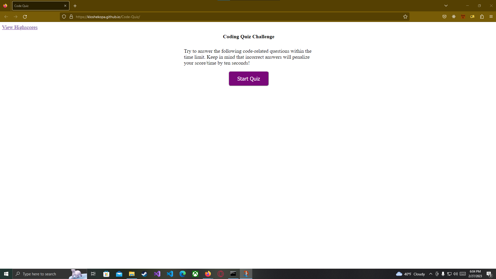

# Code-Quiz

##Description

This website is a short timed quiz to test basic coding knowledge.

##Instalation

N/A

##Usage

https://kloshekopa.github.io/Code-Quiz/

Upon loading in you will be presented with a series of instructions and a start button.

After starting, a timer will display and begin counting down. A series of questions with 4 answer buttons will apppear. Clisking on an answer will display feedback on if it was correct or not.

Upon completion, you will be prompted to add your initials to save your score.

This will take you to the scores screen.

## License

MIT License
